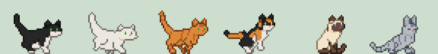

<div align="center">

# PISI 🐾



**A little pixel cat that lives on your desktop and keeps you company while you focus.**

[](https://github.com/erkambo/pisi/actions/workflows/ci.yml)
[](https://github.com/erkambo/pisi/releases/latest)
[](LICENSE)

[Download](https://github.com/erkambo/pisi/releases/latest) ·
[Browser extension](https://chromewebstore.google.com/detail/pisi-desktop-pet/aghakdlloghojgociilficjhadgilnlh) ·
[Website](https://erkamboyacioglu.com/pisi/) ·
[Privacy](https://erkamboyacioglu.com/pisi/privacy/)

</div>

PISI wanders around your screen, curls up for a nap while you work through a
Pomodoro, and wants to play when your break comes. Each focus block you
finish earns it a treat; save them up for goodies! Install the browser extension and it climbs, and interacts with
the pages you have open too.

Free, open source, no account, no ads. Nothing leaves your computer unless
you connect Google Calendar.

## What it does

- **Focus with you.** Start a block and the cat naps beside you. A small pill
  shows the time left, with pause, skip and stop.
- **Play on your breaks.**  It chases, pounces, gets tired and pants a bit.
- **A corner of its own** by your taskbar, and a shop with 40+ things to save
  up for.
- **Make it yours**  A lot of customization in Pet Studio: coat, pattern, eyes, build, even how it
  moves. Make your dream cat!
- **On web pages**, with the extension: it walks on paragraphs, climbs tables,
  knocks words off the page, pounces on what you select and watches your videos
  with you. Mark a site as distracting and it sits on it during a focus block.
- **Your calendar, if you like:** a morning summary, quiet during meetings,
  and finished focus blocks written to a calendar of its own.

## Download

| Your computer | File |
|---|---|
| Windows 10 / 11 | `PISI-Setup-<version>.exe` |
| Mac with Apple Silicon | `PISI-<version>-mac-apple-silicon.dmg` |
| Mac with Intel | `PISI-<version>-mac-intel.dmg` |
| Linux | `PISI-<version>-x86_64.AppImage` |

Get them from [the latest release](https://github.com/erkambo/pisi/releases/latest).
PISI isn't signed with a paid certificate yet, so Windows and macOS ask you to
confirm the first time (the release notes show how). Every file is listed in
`SHA256SUMS.txt`, and `gh attestation verify <file> --repo erkambo/pisi`
proves it was built here, from this code.

### The browser extension

1. In PISI: **Settings → Web pages → Set up browser bridge**. This lets the
   extension talk to PISI.
2. Get the extension from the
   [Chrome Web Store](https://chromewebstore.google.com/detail/pisi-desktop-pet/aghakdlloghojgociilficjhadgilnlh)
   (Chrome, Brave, Edge, Vivaldi). Firefox: see
   [extension/README.md](extension/README.md).
3. Pin it. Its menu turns the cat off for a site, guards the sites you'd rather
   avoid during focus, and switches the mess on or off.

It sends PISI the layout of the page and what's happening on it (a video
playing, your selection), never the words or the address, and only to PISI on
your own computer.

## Need a hand?

Right-click the cat: everything is in that menu, and **More → Show tutorial**
replays the tour. Found a bug or have an idea? **More → Report a bug or get in
touch**, or [open an issue](https://github.com/erkambo/pisi/issues/new/choose).
If something's really wrong, run PISI with `--doctor` and attach the
`doctor.txt` it writes (no window titles, file names or personal details).

To uninstall: *Settings → Apps* on Windows, or run PISI with `--uninstall` on a
Mac or Linux (`--purge` deletes your cat and its things too).

## Running from source

Python 3.10 or newer and PyQt6:

```bash
git clone https://github.com/erkambo/pisi.git
cd pisi
pip install PyQt6        # or: sudo apt install python3-pyqt6
python3 -m companion
```

`make test` runs the tests (they never touch your own cat) and `make lint`
runs ruff. Building, the code layout and releasing: [docs/DEVELOPMENT.md](docs/DEVELOPMENT.md).

## How it's made

Plain Python and Qt: no Electron, no web views, no runtime downloads.

- [`companion/creatures/`](companion/creatures/): the cat engine. A cat is a
  small genome that becomes every animation, pixel by pixel ([docs](docs/pets/README.md)).
- [`companion/things/`](companion/things/): beds, bowls and toys, drawn to fit
  your cat ([docs](docs/things/README.md)).
- [`extension/`](extension/): the browser extension, and
  [`companion/perch.py`](companion/perch.py) turns what it sees into places to stand.
- [`extensions/`](extensions/): small Cinnamon and GNOME panel extensions for
  the cat's corner.

## Contributing

Bug reports, ideas and pull requests are welcome: see
[CONTRIBUTING.md](CONTRIBUTING.md) and the [code of conduct](CODE_OF_CONDUCT.md).
Security problems go privately, as [SECURITY.md](SECURITY.md) explains.

## Licence and credits

[MIT](LICENSE), by [Erkam Boyacioglu](https://erkamboyacioglu.com). The cats'
look was inspired by
[carysaurus's Black Cat Sprites](https://carysaurus.itch.io/black-cat-sprites);
every cat you see is drawn by PISI's own engine. The meow and purr are
royalty-free recordings from Wikimedia Commons
([credits](assets/sounds/CREDITS.md)).
